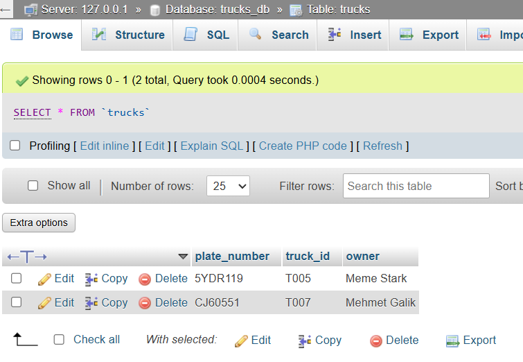
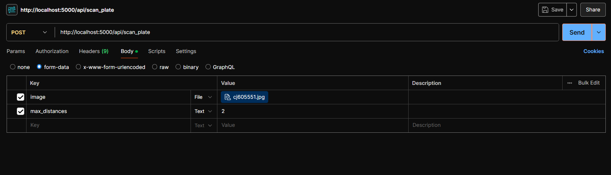
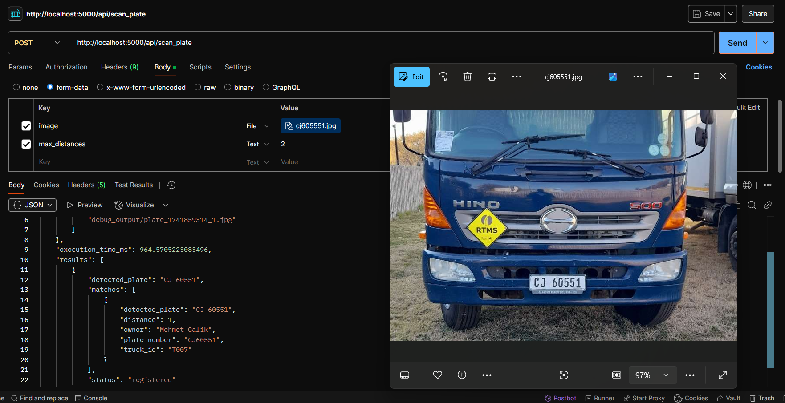

# Truck Plate Recognition Backend
This is a Flask-based backend for a truck plate recognition system designed for customs use. It processes truck number plates (OCR is handled externally), stores truck records in a MySQL database, and searches for approximate matches using a Levenshtein Distance algorithm optimized with a BK-Tree. The backend exposes RESTful APIs for a separate frontend to interact with, enabling efficient matching of plate numbers despite potential OCR errors.

## Features
- **Detection of Number Plates**: Uses Yolov8 to find the cooridinates of number plates in an image. Also, the model is further fine-tuned/trained on a custom dataset, which contain images of vehicles.
- **Text Extraction**: Uses easyOCR to extract texts from the number plates. For this project, we are using the pre-trained model.
- **Efficient Search**: Uses a BK-Tree to perform approximate string matching with Levenshtein Distance, tolerating OCR errors (e.g., "ABCI23" matches "ABC123").
- **MySQL Integration**: Stores truck records (plate number, truck ID, owner) and retrieves details for matches.
- **Modular Architecture**: Separates routes, database utilities, and search logic for maintainability.
- **API Endpoints**: Provides endpoints to search for plates and add new truck records.

## EasyOCR
EasyOCR is an open-source Python library designed for Optical Character Recognition (OCR), which means it extracts text from images or scanned documents. It’s built to be user-friendly ("easy" is in the name for a reason) and supports over 80 languages, including English, Chinese, Arabic, and more. It’s particularly useful for tasks like reading license plates, signs, or handwritten notes in images.

**How it works**: EasyOCR uses deep learning models (like convolutional neural networks) trained to detect and recognize text. It first identifies areas in an image where text exists (text detection) and then decodes those areas into readable characters (text recognition).

## YOLOv8
YOLOv8 is the latest version (as of now) of the "You Only Look Once" (YOLO) family of models, developed by Ultralytics. It’s a state-of-the-art object detection system, meaning it can identify and locate objects (like people, cars, or dogs) in images or videos in real-time. YOLOv8 builds on its predecessors with improved accuracy, speed, and versatility.

**How it works**: YOLOv8 uses a single neural network to scan an image once (hence "You Only Look Once") and predict both the bounding boxes around objects and the class of those objects (e.g., "cat," "car"). It’s fast because it doesn’t process the image multiple times like older methods.

**Example use**: In a video feed, YOLOv8 could detect and label every car and pedestrian, drawing boxes around them with labels.

## Search Algorithm

The backend implements Levenshtein Distance with a BK-Tree for efficient approximate string matching:

### Levenshtein Distance

- Measures the minimum number of single-character edits (insertions, deletions, substitutions) to transform one string into another.
- Example: Distance between "ABCI23" and "ABC123" is 1 (substitute "I" with "1").
- Time complexity: O(m * n) for two strings of lengths m and n.

### BK-Tree

- **Metric Tree**: Organizes strings based on their Levenshtein Distance from a root node.
- **Search Efficiency**: Uses the triangle inequality to prune branches during search, reducing the time complexity from O(n * m * k) (naive comparison with all database entries) to O(log n) on average for a database of n plates.
- **Example**: Searching "ABCI23" with a max distance of 2 quickly returns "ABC123" (distance 1) by avoiding unnecessary comparisons.
- **Initialization**: The BK-Tree is initialized with all plate numbers from the database on startup and updated when new trucks are added.

## Project Structure

The project structure includes the following files and directories:

- `main.py` - Flask app entry point
- `routes.py` - API routes
- `bk_tree.py` - BK-Tree and Levenshtein Distance implementation
- `models` - Yolov8 trained on a custom dataset
- `db.py` - MySQL database utilities
- `config.py` - Configuration (e.g., MySQL credentials)
- `requirements.txt` - Dependencies
- `README.md` - Documentation

## Setup Instructions

### Prerequisites

- `Python 3.8+`
- `MySQL 8.0+`
- `easyOCR`
- `flask`
- `ultralytics` (for YOLOv8)
- `easyocr`
- `opencv-python`
- `mysql-connector-python`
- `numpy`

1. **Clone the Repository**

   ```sh
   git clone <repository-url>
   cd truck_plate_backend

2. **Set Up Virtual Environment**
   
   Create a virtual environment to isolate dependencies. Open the terminal and enter:
   
   ```
   python -m venv venv
   ```
   
   Activate the virtual environment
   - On Windows:
   ```
   venv\Scripts\activate
   ```
   
   - On macOS/Linux:
   ```
   source venv/bin/activate
   ```
   
   After activation, your terminal prompt should change (e.g., ``(venv)``), indicating you're in the virtual environment
     
4. **Install Dependencies**

   ```sh
   pip install -r requirements.txt

5. ***Configure MySQL***

   ***Create Database***:
   ```sql
   CREATE DATABASE trucks_db;
   USE trucks_db;
      
   CREATE TABLE trucks (
     plate_number VARCHAR(20) PRIMARY KEY,
     truck_id VARCHAR(50) NOT NULL,
     owner VARCHAR(100)
   );
      
   -- Sample data
   INSERT INTO trucks (plate_number, truck_id, owner) VALUES
   ('5YDR119', 'T005', 'Meme Stark')
   ('CJ60551', 'T007', 'Mehmet Galik');
   ```

   **Start Xampp**
   - Start XAMPP, ensure MySQL is running.
   - Open http://localhost/phpmyadmin, and log in
   - Create trucks_db and run the above SQL in the “SQL” tab
   - Update config.py with your MySQL credentials:
     
   ```
      DB_CONFIG = {
        'host': '127.0.0.1',
        'user': 'root',
        'password': '',
        'database': 'trucks_db'
      }
   ```
   **Example Xampp**:

   


6. **Run the Backend**

   ```sh
   python main.py

The server will start at ``http://localhost:5000`` in debug mode. Ensure XAMPP’s MySQL is running if using it

### API Endpoints
***POST /api/scan_plate***
- ***Description***: This route would receive an image, along with a max_distance of 2 sent by the frontend. It consists of several functionalities: 1) Detect a number plates, 2) extract texts from the number plates, 3) search for truck records matching the provided plate number within a specified Levenshtein Distance tolerance.

  The curl command:
  ```
  curl -X POST http://localhost:5000/api/scan_plate \
  -F "image=@vehicle_image.jpg" \
  -F "max_distance=2"
  ```

  The Postman command:

  

***Response (200 OK):***
  ```
  {
    "results": [
        {
            "detected_plate": "ABC123",
            "matches": [
                {
                    "plate_number": "ABC123",
                    "truck_id": "T001",
                    "owner": "John Doe",
                    "status": "active",
                    "distance": 0,
                    "detected_plate": "ABC123"
                }
            ],
            "status": "registered"
        }
    ],
    "execution_time_ms": 305.2,
    "debug_info": {
        "annotated_image": "debug_output/annotated_1691234567.jpg",
        "cropped_plates": [
            "debug_output/plate_1691234567_0.jpg"
        ]
    }
}
```
Result (200) OK:




